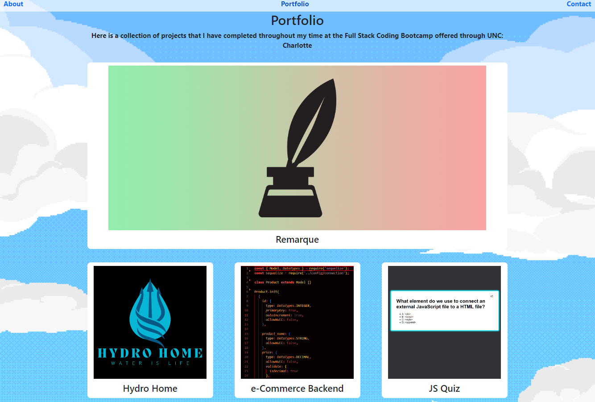

<!-- Improved compatibility of back to top link: See: https://github.com/othneildrew/Best-README-Template/pull/73 -->

<a name="readme-top"></a>

<!--
*** Thanks for checking out the Best-README-Template. If you have a suggestion
*** that would make this better, please fork the repo and create a pull request
*** or simply open an issue with the tag "enhancement".
*** Don't forget to give the project a star!
*** Thanks again! Now go create something AMAZING! :D
-->

<!-- PROJECT SHIELDS -->
<!--
*** I'm using markdown "reference style" links for readability.
*** Reference links are enclosed in brackets [ ] instead of parentheses ( ).
*** See the bottom of this document for the declaration of the reference variables
*** for contributors-url, forks-url, etc. This is an optional, concise syntax you may use.
*** https://www.markdownguide.org/basic-syntax/#reference-style-links
-->

<br />
<div align="center">

  <h3 align="center">JNighton Portfolio</h3>

  <p align="center">
    <br />
    <a href="https://github.com/jNighton/jNighton-portfolio"><strong>Explore the docs »</strong></a>
    <br />
    <br />
    <a href="https://github.com/jNighton/jNighton-portfolio">View Demo</a>
    ·
    <a href="https://github.com/jNighton/jNighton-portfolio/issues">Report Bug</a>
    ·
    <a href="https://github.com/jNighton/jNighton-portfolio/issues">Request Feature</a>
  </p>
</div>

<!-- TABLE OF CONTENTS -->
<details>
  <summary>Table of Contents</summary>
  <ol>
    <li>
      <a href="#about-the-project">About The Project</a>
      <ul>
        <li><a href="#built-with">Built With</a></li>
      </ul>
    </li>
    <li>
      <a href="#getting-started">Getting Started</a>
      <ul>
        <li><a href="#prerequisites">Prerequisites</a></li>
        <li><a href="#installation">Installation</a></li>
      </ul>
    </li>
    <li><a href="#usage">Usage</a></li>
    <li><a href="#contact">Contact</a></li>
  </ol>
</details>

<!-- ABOUT THE PROJECT -->

## About The Project



This website is a portfolio containing a comprehensive list of my projects as well as some information about myself.

<p align="right">(<a href="#readme-top">back to top</a>)</p>

### Built With

- [![React][react.js]][react-url]
- [![Express.js][express.js]][express-url]
- ![Bootstrap][bootstrap]
<p align="right">(<a href="#readme-top">back to top</a>)</p>

<!-- GETTING STARTED -->

## Getting Started

### Prerequisites

- npm
  ```sh
  npm install npm@latest -g
  ```

### Installation

2. Clone the repo
   ```sh
   git clone git@github.com:mhengerer/jNighton/jNighton-portfolio
   ```
3. Install NPM packages
   ```sh
   npm install
   ```
4. Build page
   ```sh
   npm run build
   ```

<p align="right">(<a href="#readme-top">back to top</a>)</p>

<!-- USAGE EXAMPLES -->

## Contact

Project Link: [https://github.com/jNighton/jNighton-portfolio](https://github.com/jNighton/jNighton-portfolio)

<p align="right">(<a href="#readme-top">back to top</a>)</p>

<!-- ACKNOWLEDGMENTS -->

## Acknowledgments

- [GitHub Emoji Cheat Sheet](https://www.webpagefx.com/tools/emoji-cheat-sheet)
- [GitHub Pages](https://pages.github.com)
- [React Icons](https://react-icons.github.io/react-icons/search)

<p align="right">(<a href="#readme-top">back to top</a>)</p>

<!-- MARKDOWN LINKS & IMAGES -->
<!-- https://www.markdownguide.org/basic-syntax/#reference-style-links -->

[react.js]: https://img.shields.io/badge/React-20232A?style=for-the-badge&logo=react&logoColor=61DAFB
[react-url]: https://reactjs.org/
[express.js]: https://img.shields.io/badge/express.js-%23404d59.svg?style=for-the-badge&logo=express&logoColor=%2361DAFB
[express-url]: https://expressjs.com/
[bootstrap]: https://img.shields.io/badge/Bootstrap-563D7C?style=for-the-badge&logo=bootstrap&logoColor=white
[boostrap-url]: https://getbootstrap.com/
